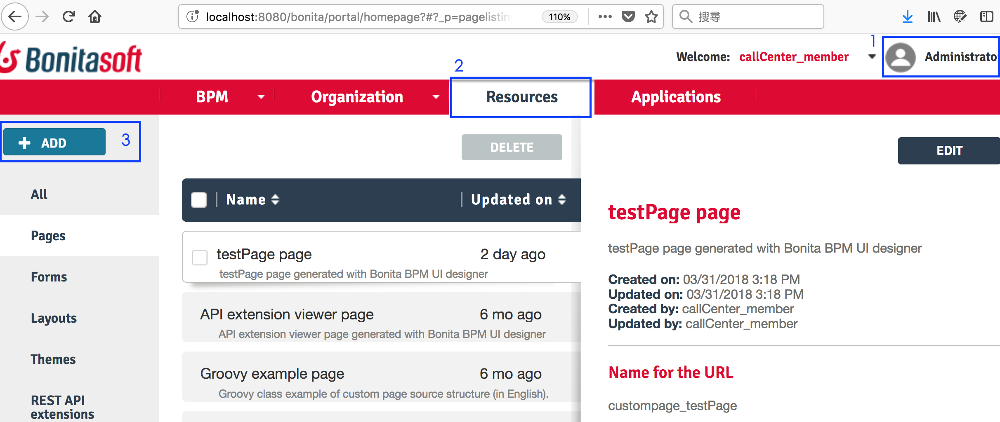

# Bonita Page Quick Start
## Bonita application
1. 下載 page-testPage.zip
2. 開啟您的 bonita server，登入bonita的portal，把User切換成Administrator。
3. 移到resource分頁，點選左方的Add按鈕，把剛剛下載的 page-testPage.zip 加進來。

4. 移到resource分頁，點選New按鈕，依下方的屬性Create。
* Display name：testcatch
* URL：../apps/ testcatch
* Version：1.0
* Profile：User

5. 在Application list有剛創建的testcatch，最左方的Actions中點選Edit（圖像為‧‧‧）。
6. Pages那區塊點選ADD，依下方的屬性Create。
* Page：選在第3步驟加進來的Page。
* URL：../apps/testcatch/ testcatch

拜訪 {您的bonita網址}/bonita/apps/testcatch/testcatch/ 就可以看到上面include的Page。
不過只有title沒有內容。上面的URL可以使用兩個參數：businessDataType 和 persistenceId。

假設您的bonita的Business Data Model中有CallCenterComplaint（CallCenter客訴流程用），
並且曾經跑過有用過這個Model的流程~~加上沒有pkill幹掉tomcat過~~，可以拜訪以下網址：

{您的bonita網址}/bonita/apps/testcatch/testcatch/?businessDataType=CallCenterComplaint&persistenceId=1

以下是結果示意圖：

## Liferay Page
以上URL可以直接用HTML的iframe語法嵌入網頁，只要使用者有登入bonita即可。
如果想寫進Liferay的Primeface頁面，可以參考下面寫法：

.xhtml
<pre><code>
<iframe id="bonitaAppFrame" name="bonitaAppFrame" frameborder="0" 
scrolling="no" height="500" width="100%" src="#{processMessage.takeURL()}">>

Your browser does not support iframes.
</iframe>
</code></pre>

processMessage.java
<pre><code>
package com.belstar.view.callcenter.detail;

import java.io.Serializable;
import javax.faces.bean.ManagedBean;
import javax.faces.bean.ViewScoped;

/**
 * view.
 * @author carol
 *
 */
@ManagedBean(name = "processMessage")
@ViewScoped
public class ProcessMessageView implements Serializable {
  /**
   * bonita基本網址。 例如：http://localhost:8080/bonita
   */
  private String bonitaURL = "http://localhost:8080/bonita";
  /**
   * business object name.  例如：CallCenterComplaint
   */
  private String businessDataType = "CallCenterComplaint";
  /**
   * persistence Id.
   */
  private int persistenceId = 1;

  /**
   * 組合出bonita page URL.
   * @return bonita page URL.
   */
  public String takeURL() {
      String url = bonitaURL + "/apps/testcatch/testcatch/?businessDataType="
          + businessDataType + "&persistenceId=" + persistenceId;
      return url;
  }

  public String getBonitaURL() {
    return bonitaURL;
  }

  public void setBonitaURL(String bonitaURL) {
    this.bonitaURL = bonitaURL;
  }

  public String getBusinessDataType() {
    return businessDataType;
  }

  public void setBusinessDataType(String businessDataType) {
    this.businessDataType = businessDataType;
  }

  public int getPersistenceId() {
    return persistenceId;
  }

  public void setPersistenceId(int persistenceId) {
    this.persistenceId = persistenceId;
  }
  
}

</code></pre>
